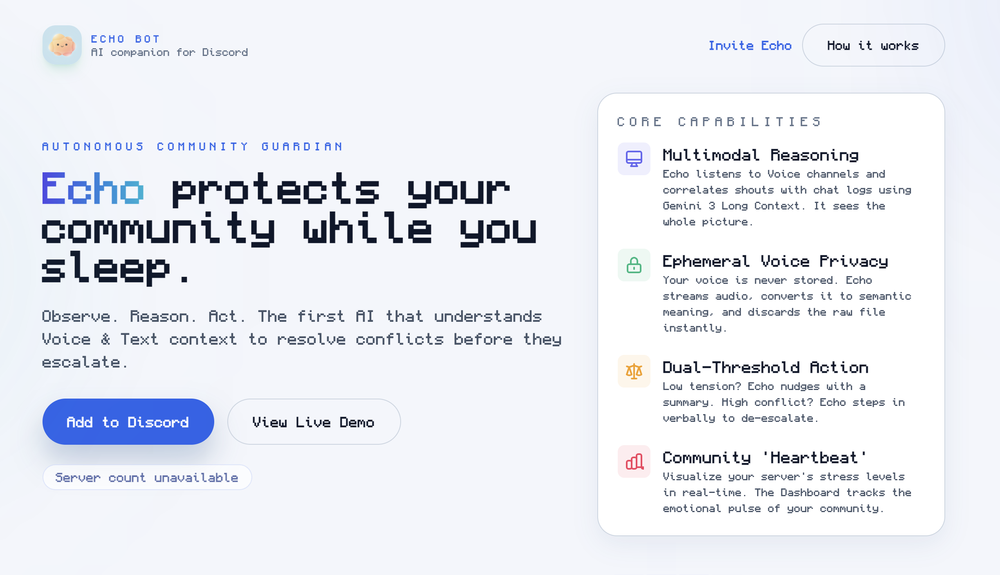
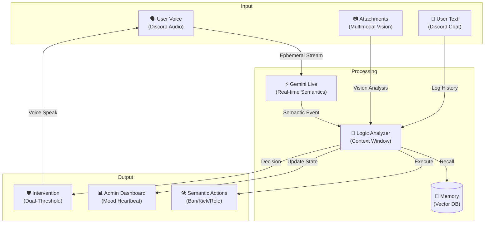



# Echo: The Autonomous Community Guardian
### Observe. Reason. Act.

<a href="https://youtu.be/7-yXKVGEld8" target="_blank">
  
</a>

---

## 🚨 The Problem: Blind, Reactive, & Burned Out
Research confirms what every mod knows: current tooling is failing.
1.  **Blind to Voice:** The most cascading conflicts happen in Voice Channels (shouting, harassment), yet bots are completely deaf to tone and aggression (Jiang et al., 2019).
2.  **Reactive & Slow:** Text-only bots act only *after* slurs are posted. They cannot detect the "rising heat" of an argument before it explodes (Connected Learning Lab, 2021).
3.  **Human Burnout:** Relying on humans for 24/7 Voice oversight is effectively impossible, leading to inconsistent enforcement and mod burnout (Keywords Studios, 2024).

## 🎯 Target Audience
Echo is built for **Mid-to-Large Servers (1k–100k+)** where Voice is central.
*   **Gaming & Hobby Communities:** Vulnerable to "Voice Raids" and fast-escalating shouts that text bots miss.
*   **Brand & Creator Servers:** Requiring 24/7 safety in Voice Stages without hiring round-the-clock staff.
*   **The Proactive Moderate:** Communities aiming to *prevent* bans by de-escalating tension early.

## 🛡️ The Solution: Echo
Echo is not just a chatbot. It is an **Autonomous Intelligence** powered by **Gemini 3**.
It sits in your server, listening to the *heartbeat* of the community. It connects the dots between a shout in a voice channel and a text message from 10 minutes ago, building a complete picture of the "Server Mood".

When tension rises, Echo judges the risk:
*   **Low Tension?** It nudges the group with a helpful summary.
*   **Safety Risk?** It verbally intervenes to de-escalate.

---

## 🏆 Why Echo? (The Competitive Edge)
While other bots are "Text-Only" or "Game-Voice-Only", Echo is the first **Holistic Server Mood AI**.

| Feature | **Echo** 🦅 | Text Analytics Bots | Voice Mods (ToxMod) |
| :--- | :---: | :---: | :---: |
| **Analyzes Text** | ✅ | ✅ | ❌ |
| **Listens to Voice** | ✅ | ❌ | ✅ |
| **Correlates Text + Voice** | ✅ **(The Magic)** | ❌ | ❌ |
| **Verbal De-escalation**| ✅ **(Speaks)** | ❌ | ❌ |

**The Gap:**
*   **Text Bots** (BetaHub) are blind to shouting matches in Voice.
*   **Voice Mods** (VoicePatrol) lack the context of the text argument that started the fight.
*   **Echo** sees the whole picture. It links a sarcastic text to a raised voice, understanding the *entire* interaction.

---

## 📐 System Architecture



---

## 🎭 The "Dual Persona" Engine
Echo adapts its personality to the medium, feeling like a natural part of the team.

### 💬 In Chat: The "Cool Friend"
In text channels, Echo is your chill co-pilot. It uses lowercase, casual phrasing, and wit. It remembers your lore, jokes about your bad takes, and feels like a member of the squad.
> **User:** "Echo u awake?"
> **Echo:** "barely. caffeine levels critical. whats up?"

### 🗣️ In Voice: The "Silent Guardian"
In voice channels, Echo shifts gears. It respects the flow of conversation and remains **silent** during banter. It only speaks when:
1.  **Safety Guidelines** are violated (Stalking, Harassment).
2.  **Conflict** reaches a boiling point.
When it speaks, it is calm, authoritative, and concise—like a mediator stepping into the room.

---

## 🧠 Core Features

### 1. Multimodal Reasoning (Gemini 3)
Most bots see "Text" or "Audio". Echo sees **Context**.
It uses Gemini 3's Long Context window to link a user's frustration in Voice Chat to a message they sent hours ago in #general. It doesn't just match keywords; it understands *intent* and *escalation*.

### 2. Ephemeral Voice Privacy 🔒
**We do NOT store your voice.**
Echo processes audio inputs via **Real-Time Ephemeral Streaming**.
1.  Audio is streamed to the processor.
2.  It is instantly converted into semantic vectors (meaning).
3.  The raw audio data is discarded immediately.
**Privacy by Design.**

### 3. Dual-Threshold Intervention
Echo isn't annoying. It calculates a "Confidence Score" before acting.
*   **Confidence > 0.4 (Nudge):** "Hey, seems like we're going in circles. Here's a summary."
*   **Confidence > 0.9 (Intervention):** "Let's pause. The tone is getting aggressive."

### 4. The Admin Dashboard
Visualize the **"Community Heartbeat"**.
Our CLI and Web Dashboards show you the real-time "Mood Score" of your server based on specialized sentiment analysis, allowing human mods to spot burnout before it happens.

---

## ⚡ Detailed Capabilities
*Features discovered in the codebase.*

### A. Semantic Moderation Suite
Forget memorizing commands. Just ask Echo.
*   **Kick/Ban:** "Echo, ban @user for being toxic about the game release." (Understands context).
*   **Timeout:** "Timeout @spammer for 10 minutes."
*   **Message Cleanup:** "Delete the last 5 messages, they're spam."

### B. Role Management
Echo acts as your server administrator.
*   **Assign Roles:** "Give everyone the 'Event' role."
*   **Create Roles:** "Make a 'Winner' role with color gold."
*   **Permissions:** Just ask Echo to modify role permissions naturally.

### C. Multimodal Vision 👁️
Echo can see what you share.
*   Upload a screenshot of code error? Echo analyzes it.
*   Share a meme? Echo understands the joke (and might roast you for it).

### D. Analytics & Insights
*   **Emerging Topics:** Tracks what your community is talking about over time.
*   **Daily Stats:** Logs message volume and sentiment trends in the database.

---

## 📚 Detailed Architecture
Want to go deeper? Read our engineering deep-dives:
*   **[The Brain (Intelligence Architecture)](core/INTELLIGENCE_SUMMARY.md)**: How the "Observe-Reason-Act" loop works.
*   **[The Ears (Voice Architecture)](voice/VOICE_SUMMARY.md)**: Inside the Ephemeral Streaming pipeline.
*   **[The Code (Structure)](STRUCTURE.md)**: Full codebase walkthrough.
*   **[Quick Ref (Cheat Sheet)](QUICK_REFERENCE.md)**: Developer quick start.

---

## 🔧 Technical Documentation

### Prerequisites
*   Node.js v18+
*   Discord Bot Token (Gateway Intent: Message Content, Voice)
*   Google Gemini API Key

### Installation

1.  **Clone & Install**
    ```bash
    git clone https://github.com/mewHacks/echo.git
    cd echo
    npm install
    ```

2.  **Configure Environment**
    Create a `.env` file:
    ```env
    DISCORD_TOKEN=your_token
    GEMINI_API_KEY=your_key
    DB_HOST=localhost
    DB_USER=root
    DB_NAME=echo
    DB_PASS=password
    ```

3.  **Run the Guardian**
    ```bash
    npm run start
    ```

### Key Modules
*   `core/analyzer.js`: The brain. Calculates Mood Score and detects triggers.
*   `core/intervention-planner.js`: The decision maker. Decides *if* and *how* to act.
*   `voiceSessionManager.js`: Handles the ephemeral audio stream to Gemini Live.
*   `dashboard.js`: CLI tool for monitoring server health.
*   `actions-config.js`: Configuration for all NLP-driven moderation tools.
