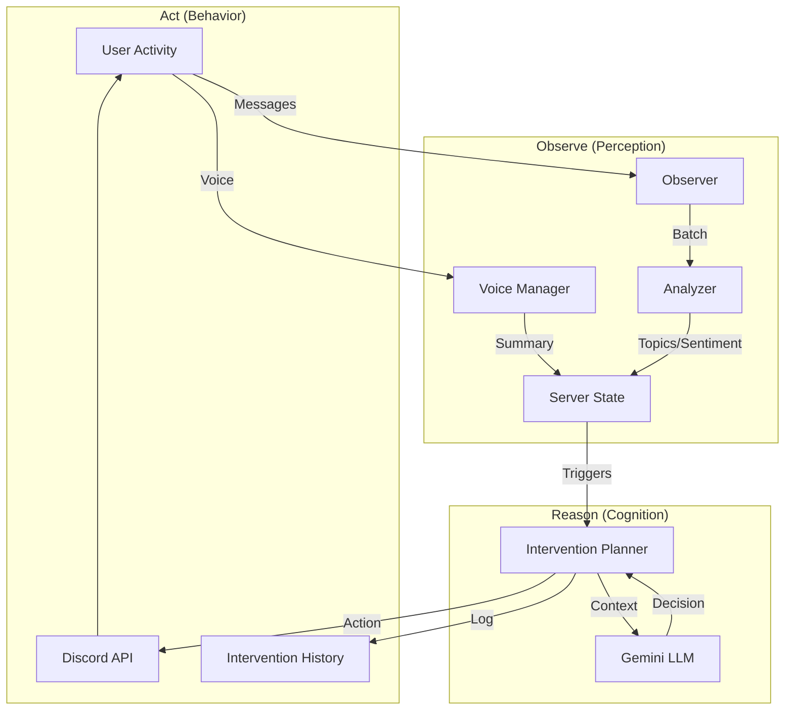

# Intelligence System Architecture

**MEE7 (Echo) - Automated Community Intelligence**

This document details the "Brain" of Echo—how it observes server activity, reasons about community dynamics, and proactively intervenes to maintain healthy conversations.

---

## The Unified Loop: Observe → Reason → Act

Echo operates on a continuous loop that transforms raw signals into reasoned attributes.



---

## 1. Perception Layer (Observer & Analyzer)

### Message Analysis (`analyzer.js`)
- **Batching**: Processes messages in dynamic batches (10-50 messages) based on server activity.
- **Metrics**: 
  - `topics`: Top 5 emerging topics with decay scores.
  - `sentiment`: Average (-1 to 1), Minimum (most negative), and Negative Ratio.
  - `events`: Discrete anomalies like `CONFLICT`, `HELP_REQUEST`, `SPAM`.

### Voice Analysis (`voiceSessionManager.js`)
- **Transcription**: Real-time Gemini Live audio processing.
- **Summarization**: Generates summaries of voice conversations every turn.
- **Cross-Modal**: Pushes voice summaries to `server-state.js` so text logic knows what happened in voice.

---

## 2. Shared Memory (`server-state.js`)

The **Server State** is the central source of truth for a guild's mood.

### Key Components
| Component | Description | Source |
|-----------|-------------|--------|
| **Mood Score** | -1.0 (Hostile) to +1.0 (Positive) | Weighted avg of text & voice |
| **Trend** | `rising`, `falling`, `stable` | Change magnitude > 0.2 |
| **Dominant Signal** | `text`, `voice`, or `mixed` | Based on recent activity volume |
| **Triggers** | Active flags needing attention | `mood_negative`, `voice_activity` |

### Context Markers
Invisible "sticky notes" that provide long-term context (30 min TTL):
- `high_stress_period`: Be supportive, ignore minor friction.
- `voice_tension`: Interpret text disagreements more charitably.
- `unresolved_tension`: Watch for escalation.

---

## 3. Cognition Layer (`intervention-planner.js`)

### Smart Triggers
The system continuously checks `checkTriggers()` against the Server State.

| Trigger | Threshold | Priority | Source |
|---------|-----------|----------|--------|
| `SAFETY_RISK` | **Regex Match** (keyword + context) | **CRITICAL** (Tier 0) | `analyzer.js` |
| `HELP_REQUEST` | Explicit "help" | **URGENT** (Tier 1) | `analyzer.js` |
| `CONFLICT` | LLM Confidence ≥ 0.7 | **STANDARD** (Tier 2) | `gemini-orchestrator.js` |
| `mood_negative` | Mood Score < -0.5 | **RELAXED** (Tier 3) | `server-state.js` |
| `voice_activity` | Active Voice Session | **STANDARD** (Tier 2) | `voiceSessionManager.js` |

### Smart Cooldowns
Prevents the bot from becoming spammy or annoying.

1. **CRITICAL (0 min)**: **Hard-coded bypass** for Safety Risks.
2. **URGENT (0 min)**: Immediate action for help requests.
3. **STANDARD (5 min)**: Normal cooldown for conflicts/events.
4. **RELAXED (15 min)**: Anti-nag timer for general mood/negativity.

### Intervention Policy
The Planner typically asks Gemini 3: *"Based on this state, should Echo intervene?"*

**⚠️ CRITICAL SAFETY OVERRIDE:**
If `SAFETY_RISK` is detected, the **LLM IS BYPASSED COMPLETELY**.
*   **Action:** `DM_MODERATOR` (Private Alert)
*   **Reason:** Safety is non-negotiable. We do not risk LLM hallucination or "hesitation" in safety scenarios.
*   **Result:** 100% reliable alert delivery.

**For non-safety events (Conflict/Mood):**
*   **Action**: `POST_SUMMARY` (Public) or `DM_MODERATOR` (Private) or `DO_NOTHING`.
*   **Targeting**: 
    1. Prefer **Source Channel** (where conflict happened).
    2. Fallback to **Preferred Channels** (`#general`, `#chat`) only for server-wide issues.
*   **Tone**: Neutral, forward-looking, "facilitation over moderation".
*   **Blast Radius**: Minimize impact. Don't post to #general for a 2-person dispute in #off-topic.

---

## 4. Data Models

### `server_state`
Single row per guild.
```sql
CREATE TABLE server_state (
    guild_id VARCHAR(32) PRIMARY KEY,
    mood_score FLOAT DEFAULT 0,
    mood_trend VARCHAR(10) DEFAULT 'stable',
    dominant_topics JSON,          -- ["java", "deadline", "pizza"]
    dominant_signal VARCHAR(10),   -- "text" or "voice"
    last_voice_summary TEXT,
    updated_at TIMESTAMP
);
```

### `intervention_history`
Audit log of all AI decisions.
```sql
CREATE TABLE intervention_history (
    id INT AUTO_INCREMENT PRIMARY KEY,
    guild_id VARCHAR(32),
    trigger_type VARCHAR(50),      -- "mood_negative,CONFLICT"
    action_taken VARCHAR(20),      -- "POST_SUMMARY"
    reasoning TEXT,                -- "High negative sentiment detected..."
    confidence FLOAT,              -- 0.85
    created_at TIMESTAMP DEFAULT CURRENT_TIMESTAMP
);
```

---

## 5. Future Intelligence Roadmap

1. **User Reputation**: Track individual user "heat" scores to identify instigators vs. peacekeepers.
2. **Predictive Intervention**: Use `mood_trend` to act *before* a conflict starts (`mood_falling` + `topic_sensitive`).
3. **Multi-turn Mediation**: Allow Echo to reply to users who respond to its intervention.

---
*Last Updated: 2026-01-16*
